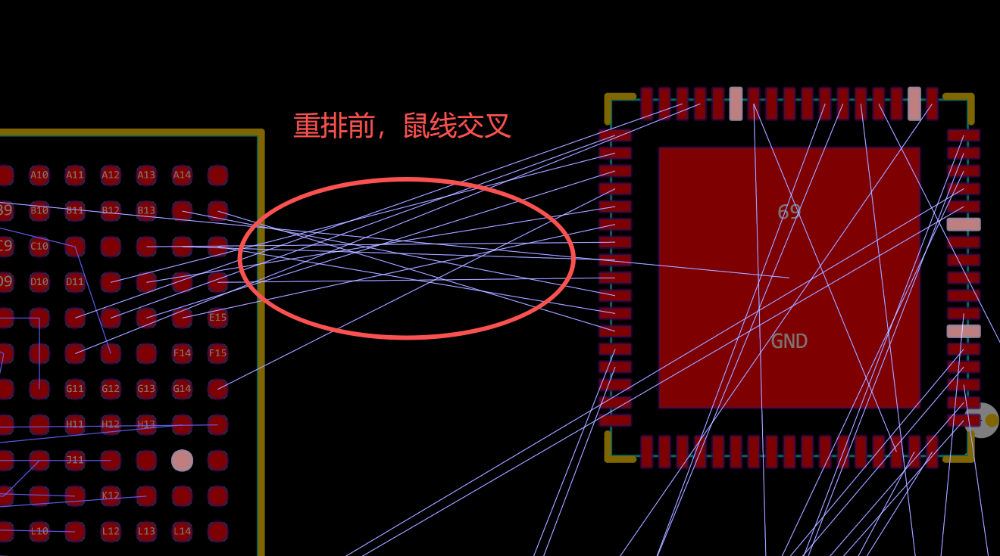
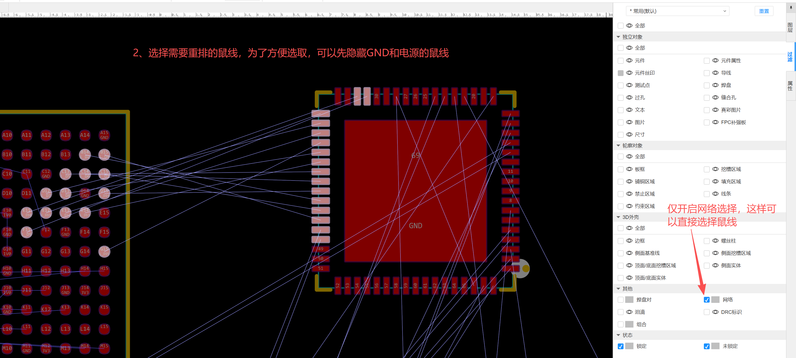
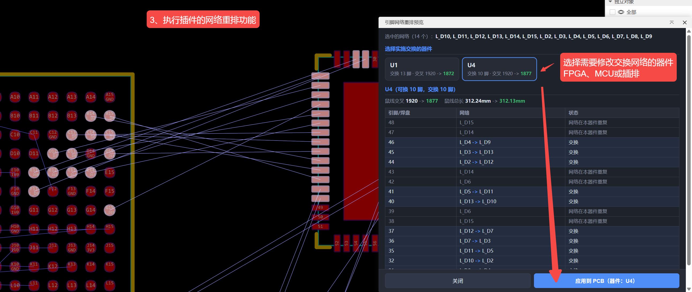
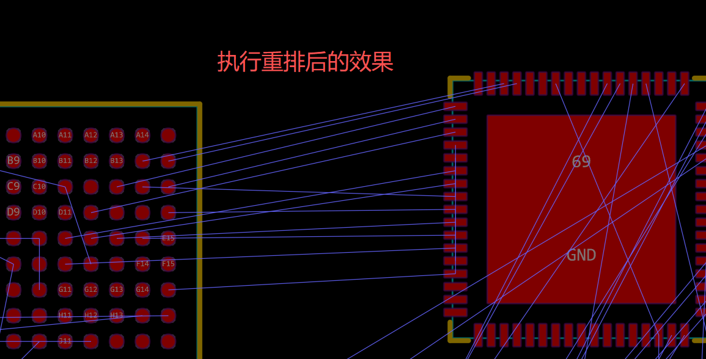
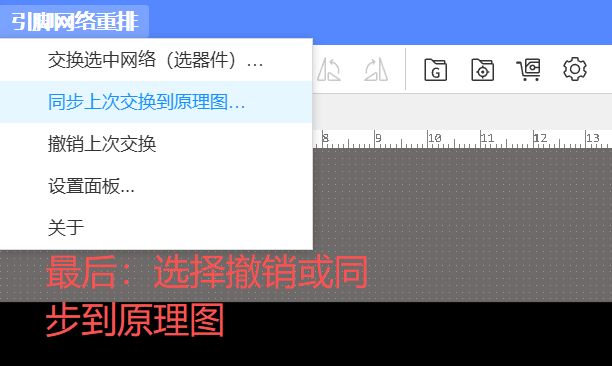
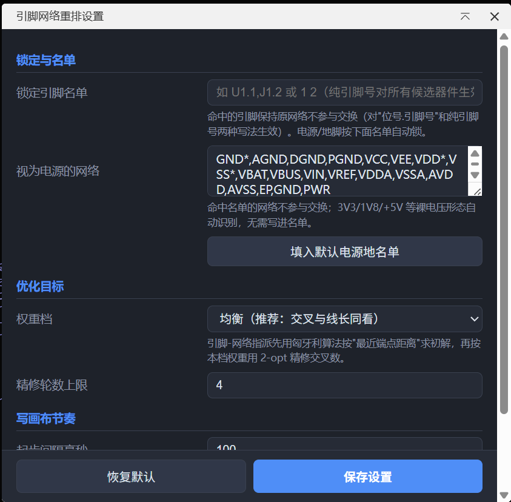

# LCEDA-sch-header-swap（引脚网络重排）

嘉立创EDA专业版扩展（PCB 侧）：在 PCB 中选中要交换的网络（如 MCU-FPGA 排线网络），从网络连接的器件中选择实施交换的器件（排插/MCU/FPGA 均可），按鼠线交叉与总线长求解最优引脚-网络指派；应用后直接改焊盘网络、画布鼠线即时可见，满意再同步原理图，不满意一键撤销。

## 解决什么问题

把 MCU/FPGA 的 IO 拉到排插或互连，是开发板与模块设计的常规操作。布局完成后，器件引脚
顺序与另一侧焊盘的鼠线经常大面积交叉，以往只能手工逐个调整某一侧的网络分配去适配布线。
本插件把这一步变成自动求解：以"器件引脚位置 ↔ 网络"的指派问题建模（匈牙利算法 +
2-opt 精修），最小化鼠线交叉与总线长。

交换的目的是好布线——所以主场在 PCB：改焊盘网络后画布鼠线即时更新（真鼠线即预览），
满意再把变更同步回原理图，不满意一键撤销。

## 功能演示

### 1. 菜单入口（PCB 编辑器 → 顶部菜单「引脚网络重排」）


### 2. 重排前：MCU-FPGA 排线鼠线大面积交叉



### 3. 选中要交换的网络（点选/框选走线或焊盘）



### 4. 执行「交换选中网络」：预览窗列出候选器件与各自方案（前后交叉数/鼠线总长）



### 5. 应用后的效果：同一批网络在所选器件上重新分配，鼠线交叉显著减少



### 6. 满意 → 同步到原理图；不满意 → 撤销



### 7. 设置：锁定引脚 / 电源名单 / 优化目标 / 写入节奏



## 使用方法（PCB 编辑器菜单「引脚网络重排」）

1. 在 PCB 中**选中要交换的网络**：点选/框选这些网络的走线或焊盘（未布线时选焊盘）。
2. 「交换选中网络（选器件）…」：弹出预览窗，列出**这些网络连接的器件**（在选中网络上
   落有 ≥2 个焊盘者）及各自的交换预览（每脚新旧网络、前后交叉数/鼠线总长、锁定原因），
   点选实施交换的器件。
3. 「应用到 PCB」：直接改写该器件焊盘网络并保存、刷新鼠线——观察画布真鼠线。
4. 满意 → 「同步上次交换到原理图…」（器件引脚的独占导线自动改网络；汇入结点/电源
   符号承载的引脚会列入手工清单）；不满意 → 「撤销上次交换」（PCB 与原理图一并恢复）。
5. 反悔随时可撤销（含已同步的情况）。

## 重要：自动保存与备份

- **应用 / 撤销会自动保存 PCB，同步会自动保存原理图**，并且写操作完成后会
  **自动重新加载 PCB 页签**（画布与鼠线即时重建，属正常现象）。
- 插件虽然自带「撤销上次交换」（按台账恢复焊盘与导线网络），但改网络属批量写操作，
  **建议先对工程备份**（编辑器内 文件 → 备份/另存为，或复制整个工程）再执行。
- 同步前原理图与 PCB 网络不一致属预期（以 PCB 为准），请尽快同步或撤销。

## 要求与限制

- 交换发生在选中的网络集合内部，器件其它引脚不受影响；请确保所选网络在该器件上
  确实可互换（如全 GPIO），差分/专用功能网络请勿选入。
- 电源/地脚默认按名单自动锁定（3V3/1V8 等裸电压形态自动识别），任意引脚可在设置中锁定。
- 原理图自动同步要求器件引脚由**带网络名的导线**（原生虚拟网络标签）承载；
  其余连接形态会列入手工清单而不是误改。
- `pcb_PrimitivePad.modify` / `sch_PrimitiveWire.modify` 为 BETA 接口，旧客户端：
  焊盘改写失败会列明细；导线改写自动退级"按原折线删建"。
- 多 PCB 工程暂使用名称排序的第一个 PCB（若与当前激活文档不一致会提示）。
- 在嘉立创EDA专业版 V3.2.149 实机开发验证；写路径按 V3.2 形态适配（焊盘经器件引脚
  对象 `setState_Net` 写入，写后自动重开 PCB 页签重建画布）。

## 开发

```bash
node test/run-offline.ts   # 离线测试（179 断言）
npx eslint src test config
npx tsc --noEmit -p tsconfig.json
npm run build              # 产出 build/dist/lceda-sch-header-swap_vX.Y.Z.eext
node test/verify-pkg.cjs   # 包内容核验（含 images 硬校验）
npm run test:bundle        # 构建产物冒烟（入口求值/预览/应用/同步/撤销/错误路径）
```

## License

Apache-2.0
